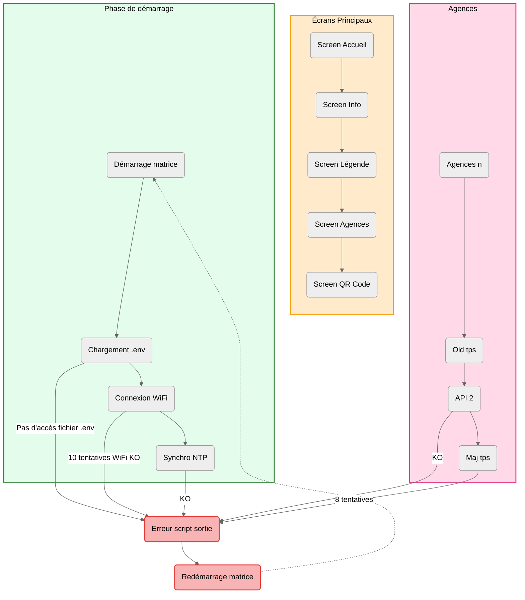

```mermaid
%%{init: {'theme':'neutral', 'themeVariables': {'background':'#ffffff'}}}%%

flowchart TB

%% Définition des styles de couleur
classDef green fill:#E3FCEC,stroke:#2e7d32,stroke-width:2px,color:#000
classDef orange fill:#FFEACC,stroke:#f59e0b,stroke-width:2px,color:#000
classDef pink fill:#FFD9E8,stroke:#DB2777,stroke-width:2px,color:#000
classDef red fill:#f8b4b4,stroke:#e53935,stroke-width:2px,color:#000

%% --- 1) Sous-graphe de démarrage ---
subgraph S1[Phase de démarrage]
direction TB
    D1(Démarrage matrice)
    D2(Chargement .env)
    D3(Connexion WiFi)
    D4(Synchro NTP)
    
    D1 --> D2
    D2 --> D3
    D3 --> D4
end
class S1 green

%% Liaisons d'erreur possibles
D2 -- "Pas d'accès fichier .env" --> E1(Erreur script<br>Sortie)
D3 -- "10 tentatives WiFi KO" --> E1
D4 -- "KO" --> E1

%% --- 2) Sous-graphe des écrans principaux ---
subgraph S2[Écrans Principaux]
direction TB
    SC1(Screen Accueil)
    SC2(Screen Info)
    SC3(Screen Légende)
    SC4(Screen Agences)
    SC5(Screen QR Code)
    
    SC1 --> SC2
    SC2 --> SC3
    SC3 --> SC4
    SC4 --> SC5
end
class S2 orange

%% --- 3) Sous-graphe de la gestion des agences ---
subgraph S3[Agences]
direction TB
    A1(Agences n)
    A2(Old tps)
    A3(API 2)
    A4(Maj tps)
    
    A1 --> A2
    A2 --> A3
    A3 --> A4
end
class S3 pink

%% Erreurs lors de l'appel ou de la mise à jour
A3 -- "KO" --> E1
A4 -- "8 tentatives" --> E1

%% Noeud d'erreur global
E1(Erreur script sortie)
class E1 red

%% Redémarrage
R1(Redémarrage matrice)
class R1 red

E1 --> R1
R1 -.-> D1
```
