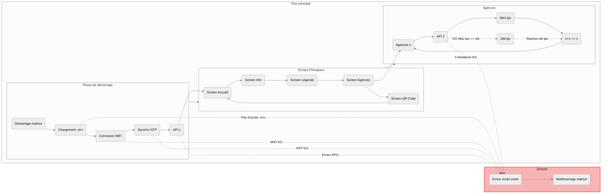

```mermaid
%%{init: {'theme':'neutral', 'themeVariables': {'background':'#ffffff'}}}%%

flowchart LR

%% Couleurs
classDef green fill:#E3FCEC,stroke:#2e7d32,stroke-width:2px,color:#000
classDef orange fill:#FFEACC,stroke:#f59e0b,stroke-width:2px,color:#000
classDef blue fill:#CCE5FF,stroke:#004085,stroke-width:2px,color:#000
classDef red fill:#f8b4b4,stroke:#e53935,stroke-width:2px,color:#000

%% --- Flux principal à gauche ---
subgraph LEFT[Flux principal]
direction TB

    %% Sous-graphe S1 : Phase de démarrage
    subgraph S1[Phase de démarrage]
    direction TB
        D1(Démarrage matrice)
        D2(Chargement .env)
        D3(Connexion WiFi)
        D4(Synchro NTP)
        D5(API 1)
        
        D1 --> D2
        D2 --> D3
        D3 --> D4
        D4 --> D5
    end
    class S1 green

    %% Sous-graphe S2 : Écrans Principaux
    subgraph S2[Écrans Principaux]
    direction TB
        SC1(Screen Accueil)
        SC2(Screen Info)
        SC3(Screen Légende)
        SC4(Screen Agences)
        SC5(Screen QR Code)
        
        D5 --> SC1
        SC1 --> SC2
        SC2 --> SC3
        SC3 --> SC4
        SC4 --> SC5
        SC5 --> SC1
    end
    class S2 orange

    %% Sous-graphe S3 : Agences
    subgraph S3[Agences]
    direction TB
        A1(Agences n)
        A2(API 2)
        A3(MaJ tps)
        A4(Old tps)
        A5(n+1 => n)

        SC4 --> A1
        A1 --> A2
        A2 --> A3
        A3 --> A5
        A5 --> A1
    end
    class S3 blue

    %% Chaînage vertical S1 -> S2 -> S3
    S1 --> S2 --> S3

end

%% --- Sous-graphe ERRORS à droite ---
subgraph ERRORS[Erreurs]
direction TB
    E1(Erreur script sortie)
    R1(Redémarrage matrice)
    E1 --> R1
end
class ERRORS red

%% --- Traits en pointillés vers le bloc d'erreur ---
D2 -. "Pas d'accès .env" .-> E1
D3 -. "WiFi KO" .-> E1
D4 -. "NTP KO" .-> E1
D5 -. "Erreur API1" .-> E1
A2 -. "5 tentatives KO" .-> E1
A2 -. "KO MaJ tps => old" .-> A4
A4 -. "Reprise old tps" .-> A5
```
