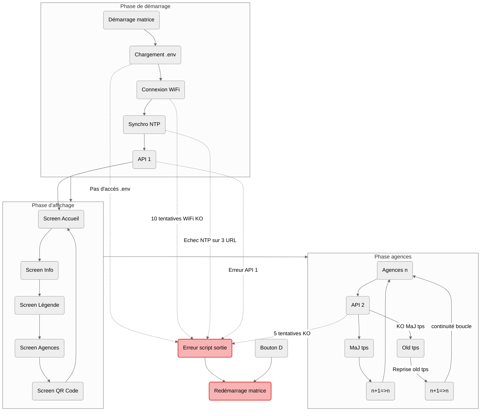

```mermaid
%%{init: {'theme':'neutral','themeVariables':{'background':'#ffffff'}}}%%
flowchart TB

%% --- Sous-graphe 1 : Démarrage ---
subgraph S1[Phase de démarrage]
direction TB
    D1("Démarrage matrice") --> D2("Chargement .env")
    D2 --> D3("Connexion WiFi")
    D3 --> D4("Synchro NTP")
    D4 --> D5("API 1")
end

%% --- Sous-graphe 2 : Écrans ---
subgraph S2[Phase d'affichage]
direction TB
    SC1("Screen Accueil") --> SC2("Screen Info")
    SC2 --> SC3("Screen Légende")
    SC3 --> SC4("Screen Agences")
    SC4 --> SC5("Screen QR Code")
    SC5 --> SC1
end

%% --- Sous-graphe 3 : Agences ---
subgraph S3[Phase agences]
direction TB
    A1("Agences n") --> A2("API 2")
    A2 --> A3("MaJ tps")
    A3 --> A5("n+1=>n")
    A5 --> A1

    A2 -- "KO MaJ tps" --> A4("Old tps")
    A4 -- "Reprise old tps" --> A6("n+1=>n")
    A6 -- "continuité boucle" --> A1
end

%% --- Enchaînement Séquentiel ---
S1 --> S2
S2 --> S3

%% --- Gestion des erreurs (noeud unique ou multiples) ---
E1("Erreur script sortie"):::red
R1("Redémarrage matrice"):::red
E1 --> R1

%% --- Liaisons externes en pointillé vers l'erreur ---
D2 -. "Pas d'accès .env" .-> E1
D3 -. "10 tentatives WiFi KO" .-> E1
D4 -. "Echec NTP sur 3 URL" .-> E1
D5 -. "Erreur API 1" .-> E1
A2 -. "5 tentatives KO" .-> E1

%% --- Lien D5 -> SC1 si nécessaire ---
D5 --> SC1

%% --- Bouton D (redémarrage) ---
F2("Bouton D") --> R1

%% --- Styles complémentaires ---
classDef red fill:#f8b4b4,stroke:#e53935,stroke-width:2px,color:#000
```
