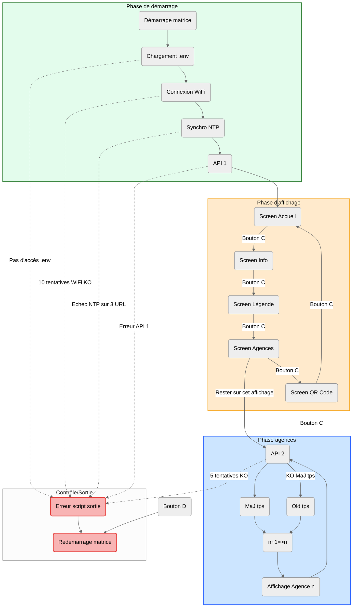

```mermaid
---
config:
  theme: neutral
  themeVariables:
    background: '#ffffff'
---
flowchart TB
 subgraph S1["Phase de démarrage"]
    direction TB
        D2("Chargement .env")
        D1("Démarrage matrice")
        D3("Connexion WiFi")
        D4("Synchro NTP")
        D5("API 1")
  end
 subgraph S2["Phase d'affichage"]
    direction TB
        SC2("Screen Info")
        SC1("Screen Accueil")
        SC3("Screen Légende")
        SC4("Screen Agences")
        SC5("Screen QR Code")
  end
 subgraph S3["Phase agences"]
    direction TB
        A2("API 2")
        A1(" Affichage Agence n")
        A3("MaJ tps")
        A5("n+1=>n")
        A4("Old tps")
  end
 subgraph S4["Contrôle/Sortie"]
        E1("Erreur script sortie")
        R1("Redémarrage matrice")
  end
    D1 --> D2
    D2 --> D3
    D3 --> D4
    D4 --> D5
    SC1 -- "Bouton C" --> SC2
    SC2 -- "Bouton C" --> SC3
    SC3 -- "Bouton C" --> SC4
    SC4 -- "Bouton C" --> SC5
    SC4 -- "Rester sur cet affichage" --> A2
    SC5 -- "Bouton C" --> SC1 & A2
    A1 --> A2
    A2 --> A3
    A3 --> A5
    A5 --> A1
    A2 -- KO MaJ tps --> A4
    D2 -. "Pas d'accès .env" .-> E1
    D3 -. 10 tentatives WiFi KO .-> E1
    D4 -. Echec NTP sur 3 URL .-> E1
    D5 -. Erreur API 1 .-> E1
    A2 -. 5 tentatives KO .-> E1
    D5 --> SC1
    E1 --> R1
    F2("Bouton D") --> R1
    A4 --> A5
     E1:::red
     R1:::red
    classDef red fill:#f8b4b4,stroke:#e53935,stroke-width:2px,color:#000
    linkStyle 10 stroke:none

%% Styles de sous-graphes
style S1 fill:#E3FCEC,stroke:#2e7d32,stroke-width:2px,color:#000
style S2 fill:#FFEACC,stroke:#f59e0b,stroke-width:2px,color:#000
style S3 fill:#CCE5FF,stroke:#2962FF,stroke-width:2px,color:#000
```
